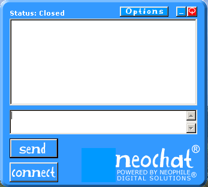

<div align="center">

## NeoChat TCP Client/Server


</div>

### Description

NeoChat is a full TCP Client/server app. using the Winsock control. It also features rounded and borderless forms, use of INI files, uses flash movies for animation, etc. This is my first submission to PSC, so be kind.
 
### More Info
 
You need to have a flash player (flash.ocx) installed on your machine to see the animations. If you don't, just remove the references to it and delete the flash controls from frmClient and frmMainServer.


<span>             |<span>
---                |---
**Submitted On**   |2002-09-07 11:08:54
**By**             |[Ernst Kruger](https://github.com/Planet-Source-Code/PSCIndex/blob/master/ByAuthor/ernst-kruger.md)
**Level**          |Intermediate
**User Rating**    |5.0 (25 globes from 5 users)
**Compatibility**  |VB 6\.0
**Category**       |[Complete Applications](https://github.com/Planet-Source-Code/PSCIndex/blob/master/ByCategory/complete-applications__1-27.md)
**World**          |[Visual Basic](https://github.com/Planet-Source-Code/PSCIndex/blob/master/ByWorld/visual-basic.md)
**Archive File**   |[NeoChat\_TC128462982002\.zip](https://github.com/Planet-Source-Code/ernst-kruger-neochat-tcp-client-server__1-38786/archive/master.zip)

### API Declarations

```
Declare Function GetPrivateProfileString Lib "kernel32" _
 Alias "GetPrivateProfileStringA" (ByVal lpApplicationName As String, _
 ByVal lpKeyName As Any, ByVal lpDefault As String, _
 ByVal lpReturnedString As String, ByVal nSize As Long, _
 ByVal lpFileName As String) As Long
Declare Function WritePrivateProfileString Lib "kernel32" _
 Alias "WritePrivateProfileStringA" (ByVal lpApplicationName As String, _
 ByVal lpKeyName As Any, ByVal lpString As Any, ByVal lpFileName As String) _
 As Long
Public Declare Function Beep Lib "kernel32" _
(ByVal dwFreq As Long, ByVal dwDuration As Long) As Long
Public Declare Function GetActiveWindow Lib "user32" () As Long
Public Declare Function FlashWindow Lib "user32" (ByVal hwnd As Long, ByVal bInvert As Long) As Long
Private Declare Function ReleaseCapture Lib "user32" () As Long
Private Declare Function SendMessage Lib "user32" Alias _
  "SendMessageA" (ByVal hwnd As Long, ByVal wMsg As Long, _
  ByVal wParam As Long, lParam As Any) As Long
Declare Function CreateRoundRectRgn Lib "gdi32" _
  (ByVal X1 As Long, ByVal Y1 As Long, _
  ByVal X2 As Long, ByVal Y2 As Long, _
  ByVal X3 As Long, ByVal Y3 As Long) As Long
Declare Function SetWindowRgn Lib "user32" _
  (ByVal hwnd As Long, ByVal hRgn As Long, _
  ByVal bRedraw As Boolean) As Long
```


